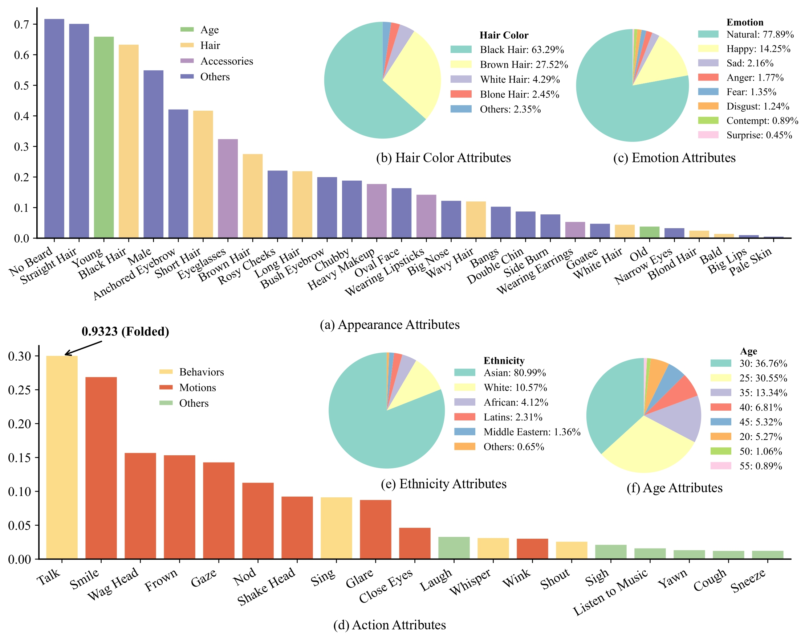

<div align="center">

# DH-FaceVid-1K: A Large-Scale High-Quality Dataset for Face Video Generation

<span style="color: #0077cc; font-size: 24px; font-weight: bold;">ICCV 2025</span>


[](https://arxiv.org/abs/2410.07151)
[](https://dh-facevid-1k.github.io/DH-FaceVid-1K/)
[](https://docs.google.com/forms/d/e/1FAIpQLSd92kS6ZdAGLoN6DvYUVUDCo7R3Oe6GNVPjQn4sDBPJH7_2_A/viewform)

</div>


Official repository of **​​DH-FaceVid-1K: A Large-Scale High-Quality Dataset for Face Video Generation**, ICCV 2025

*[Donglin Di](https://scholar.google.com/citations?hl=zh-CN&user=L8tcNioAAAAJ), [He Feng](https://github.com/fenghe12), [Wenzhang Sun](https://scholar.google.hk/citations?user=3-9aEOQAAAAJ&hl=zh-CN&oi=ao), [Yongjia Ma](https://scholar.google.hk/citations?user=BszRJxkAAAAJ&hl=zh-CN&oi=ao), [Hao Li](#), [Chen Wei](#), [Lei Fan](https://hellodfan.github.io/), [Tonghua Su](https://scholar.google.hk/citations?hl=zh-CN&user=67fxVzoAAAAJ), [Xun Yang](https://scholar.google.hk/citations?hl=zh-CN&user=ro8lzsUAAAAJ)*


## Dataset Overview


Overview of DH-FaceVid-1K Dataset. It consists of 270,043 video clips along with corresponding spoken audio and annotations, featuring more than 20,000 unique identities and over 1,200 hours of facial video footage captured under various environmental conditions and lighting scenarios. Notably, 83% of the dataset represents Asian individuals, addressing the significant shortage of open-source Asian face video datasets.


## Download

**Scale:** 270k samples / 1.2k hrs duration / ~4.01 TB

If you wish to download the DH-FaceVid-1K dataset, please follow these steps:

1.  **Fill out the form**: To prevent misuse of the dataset, we require you to submit information for review and approval. Please carefully fill out [**this form**](https://forms.gle/vEyouWdS9CgcRFMt9). **You must use an official institutional email address and clearly state your research purpose.** Requests from personal email providers (e.g., Gmail, Outlook) will be rejected. When filling out the form, ensure your information is accurate, especially **your email address**, as this is where we will send the download instructions.

2.  **Await email delivery**: Once we receive and approve your submission, we will send you an email with download instructions, typically **within 2-3 days**. Please keep an eye on your inbox, including the spam or junk mail folders, to avoid missing our message.

3.  **Download the dataset**: After receiving the email, you can click the download link provided and follow the instructions on the page to complete the download process. If you encounter any issues or do not receive the email within a reasonable time, please contact us at **fenghe021209@gmail.com**, and we will do our best to assist you.

**Note:** These video samples are sourced from crowd-sourcing platforms. To ensure the proper use of the data and prevent misuse, we manually review all download requests. By downloading and using this dataset, you are required to comply with [**the license agreement**](https://github.com/DH-FaceVid-1K/DH-FaceVid-1K/blob/main/LICENSE). Thank you for your understanding and cooperation.

## Open-source Plan

Our open-source roadmap is as follows. We will update the status here as we make progress.

- [ ] **Phase 1:** Open filtered public datasets video ID list
- [ ] **Phase 2:** Open 10% of total data
- [ ] **Phase 3:** Open 40% of total data
- [ ] **Phase 4:** Open 50% of total data


## Video Samples in DH-FaceVid-1K


<table class="center" style="border-collapse: collapse; margin: auto;">
  <!-- Row 1 -->
  <tr>
    <td width="20%" style="border: none; padding: 5px;"></td>
    <td width="20%" style="border: none; padding: 5px;"></td>
    <td width="20%" style="border: none; padding: 5px;"></td>
    <td width="20%" style="border: none; padding: 5px;"></td>
    <td width="20%" style="border: none; padding: 5px;"></td>
  </tr>

  <!-- Row 2 -->
  <tr>
    <td width="20%" style="border: none; padding: 5px;"></td>
    <td width="20%" style="border: none; padding: 5px;"></td>
    <td width="20%" style="border: none; padding: 5px;"></td>
    <td width="20%" style="border: none; padding: 5px;"></td>
    <td width="20%" style="border: none; padding: 5px;"></td>
  </tr>

  <!-- Row 3 -->
  <tr>
    <td width="20%" style="border: none; padding: 5px;"></td>
    <td width="20%" style="border: none; padding: 5px;"></td>
    <td width="20%" style="border: none; padding: 5px;"></td>
    <td width="20%" style="border: none; padding: 5px;"></td>
    <td width="20%" style="border: none; padding: 5px;"></td>
  </tr>

  <!-- Row 4 -->
  <tr>
    <td width="20%" style="border: none; padding: 5px;"></td>
    <td width="20%" style="border: none; padding: 5px;"></td>
    <td width="20%" style="border: none; padding: 5px;"></td>
    <td width="20%" style="border: none; padding: 5px;"></td>
    <td width="20%" style="border: none; padding: 5px;"></td>
  </tr>

  <!-- Row 5: Alphanumeric IDs -->
  <tr>
    <td width="20%" style="border: none; padding: 5px;"></td>
    <td width="20%" style="border: none; padding: 5px;"></td>
    <td width="20%" style="border: none; padding: 5px;"></td>
    <td width="20%" style="border: none; padding: 5px;"></td>
    <td width="20%" style="border: none; padding: 5px;"></td>
  </tr>
  
  <!-- Row 6: More Alphanumeric IDs -->
  <tr>
    <td width="20%" style="border: none; padding: 5px;"></td>
    <td width="20%" style="border: none; padding: 5px;"></td>
    <td width="20%" style="border: none; padding: 5px;"></td>
    <td width="20%" style="border: none; padding: 5px;"></td>
    <td width="20%" style="border: none; padding: 5px;"></td>
  </tr>

  <!-- Row 7: Final Selection with Complex Names -->
  <tr>
    <td width="20%" style="border: none; padding: 5px;"></td>
    <td width="20%" style="border: none; padding: 5px;"></td>
    <td width="20%" style="border: none; padding: 5px;"></td>
    <td width="20%" style="border: none; padding: 5px;"></td>
    <td width="20%" style="border: none; padding: 5px;"></td>
  </tr>
</table>

## Face Video Datasets Comparison

Compared with other datasets, FaceVid-1K has a larger data volume, competitive quality, and richer attribute annotations.


## Statistics

Distributions of general appearances, hair colors, emotions, actions, ethnicity, and age.



## Collection Pipeline


## Comprehensive Attribute List

Comprehensive attribute list of DH-FaceVid-1K, including ethnicities, appearance details, emotions, actions, and lighting conditions.


## Video Samples

> All videos resized to 256×256 for optimal viewing, please visit our page for video samples.


## Trained Model Weights

comming soon....


<!-- Human-centric generative models are becoming increas-
ingly popular, giving rise to various innovative tools and
applications, such as talking face videos conditioned on text
or audio prompts. The core of these capabilities lies in pow-
erful pretrained foundation models, trained on large-scale,
high-quality datasets. However, many advanced methods
rely on in-house data subject to various constraints, and
other current studies fail to generate high-resolution face
videos, which is mainly attributed to the significant lack of
large-scale, high-quality face video datasets. In this pa-
per, we introduce a human face video dataset, DH-FaceVid-
1K. Our collection spans 1200 hours in total, encompass-
ing 270,043 video samples from over 20,000 individuals.
Each sample includes corresponding speech audio, facial
keypoints, and text annotations. Compared to other pub-
licly available datasets, ours distinguishes itself through its
multi-ethnic coverage and high-quality comprehensive in-
dividual attributes. We establish multiple face video gen-
eration models supporting tasks such as text-to-video and
image-to-video generation. In addition, we develop com-
prehensive benchmarks to validate the scaling law when us-
ing different proportions of our dataset. Our primary aim is
to contribute a face video dataset, particularly addressing
the underrepresentation of Asian faces in existing curated
datasets and thereby enriching the global spectrum of face-
centric data and mitigating demographic biases. -->


If you find DH-FaceVid-1K dataset useful for your work or use data from DH-FaceVid-1K dataset, please cite:
```
@inproceedings{di2025dhfacevid1k,
  title={DH-FaceVid-1K: A Large-Scale High-Quality Dataset for Face Video Generation},
  author={Donglin Di and He Feng and Wenzhang Sun and Yongjia Ma and Hao Li and Chen Wei and Lei Fan and Tonghua Su and Xun Yang},
  booktitle={Proceedings of the IEEE/CVF International Conference on Computer Vision},
  year={2025}
}
```

<!-- # Website License
<a rel="license" href="http://creativecommons.org/licenses/by-sa/4.0/"></a><br />This work is licensed under a <a rel="license" href="http://creativecommons.org/licenses/by-sa/4.0/">Creative Commons Attribution-ShareAlike 4.0 International License</a>. -->
